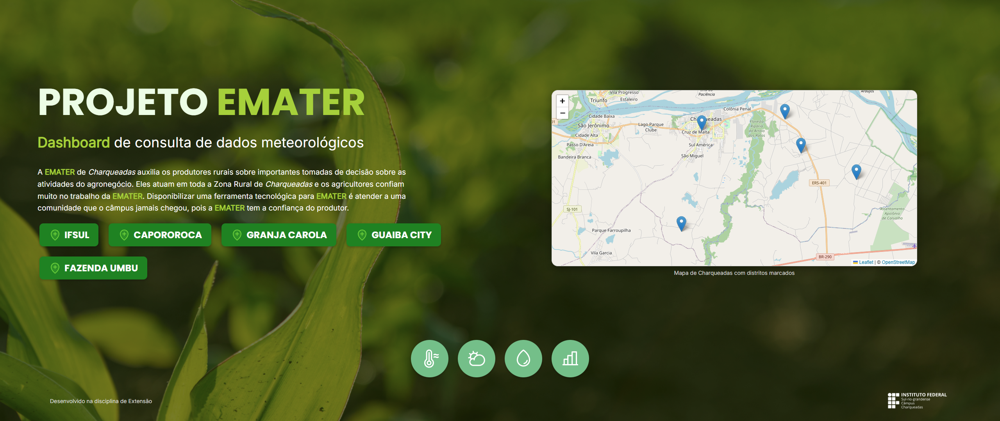
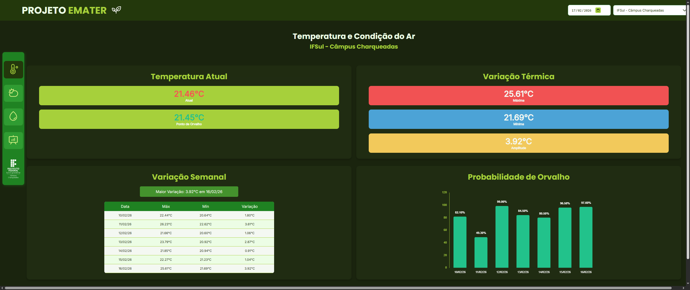
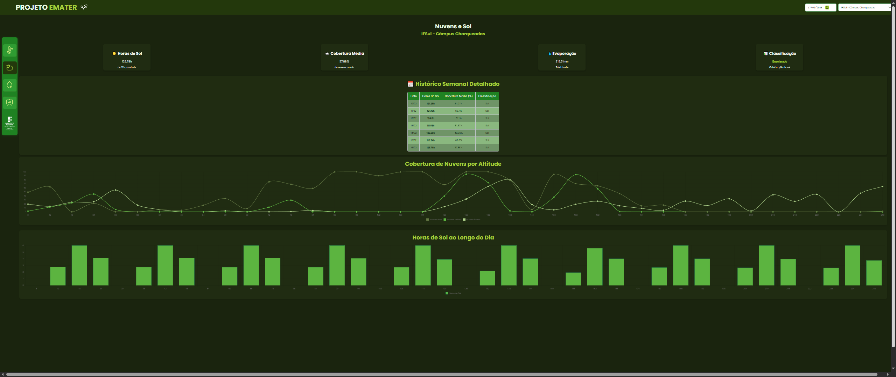
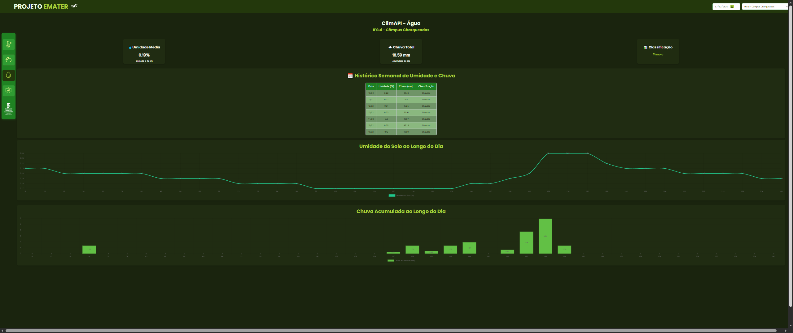
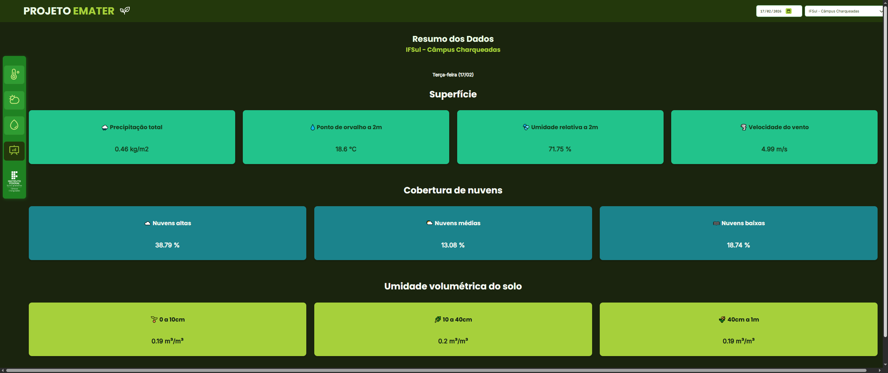

## Monitoramento Meteorológico Online da Zona Rural de Charqueadas
Monitoramento Meteorológico Online da Zona Rural de Charqueadas is an interactive dashboard developed for the EMATER of Charqueadas to monitor local agrometeorological conditions. It integrates data from public sources and serves as a proof of concept for a future low-cost IoT rain gauge network connected to an institute-owned API. 
Developed by students from Atividade de Extensão II (IFSul — Tecnologia em Sistemas para Internet).

## Technology 

Here are the technologies used in this project.

* React + Vite
* Leaflet
* React-Leaflet
* React Router DOM
* OpenStreetMap
* Chart.js + react-chartjs-2
* @phosphor-icons/react

## Services Used

* EMBRAPA - AgroAPI
* INMET
* OpenStreetMap
* IFSul - Deploy

## Packages / Libraries

* @phosphor-icons/react
* react-router-dom
* leaflet
* react-leaflet
* chart.js
* react-chartjs-2

## Getting started

* Dependency
  - Node.js (18+ recommended)
  - npm (or pnpm/yarn)

* Usage
  - Check the `agroapi-primeiros-passos-token.pdf` file to generate tokens and replace the values in the `.env` file.
  - If you get `Error 429` (Too Many Requests), the token has expired and must be generated again.

* Package installation
~~~bash
npm install
npm install @phosphor-icons/react
npm install react-router-dom
npm install react-chartjs-2 chart.js
~~~

* To run the project:

~~~bash
npm run dev
~~~

* Build / Preview:

~~~bash
npm run build
npm run preview
~~~

- `/`: Initial Page

- `/clima/:nomeBairro/temperatura`: Temperature and Air Conditions

- `/clima/:nomeBairro/nuvens`: Clouds and Sun

- `/clima/:nomeBairro/agua`: Water

- `/clima/:nomeBairro/dados`: Data Summary

## Links
  - Link: https://extensao.charqueadas.ifsul.edu.br/dashboard-emater
  - Repository: https://github.com/joaooneta/dashboard-emater
    - In case of sensitive bugs like security vulnerabilities, please joaomatheusoneta01@gmail.com directly instead of using issue tracker. We value your effort to improve the security and privacy of this project!

  ## Versioning

  1.0.0.0

## Authors
  * **João Oneta**
  * Turma de Atividade de Extensão II (IFSul — TSI)

Please follow github and join us! 
Thanks to visiting me and good coding!